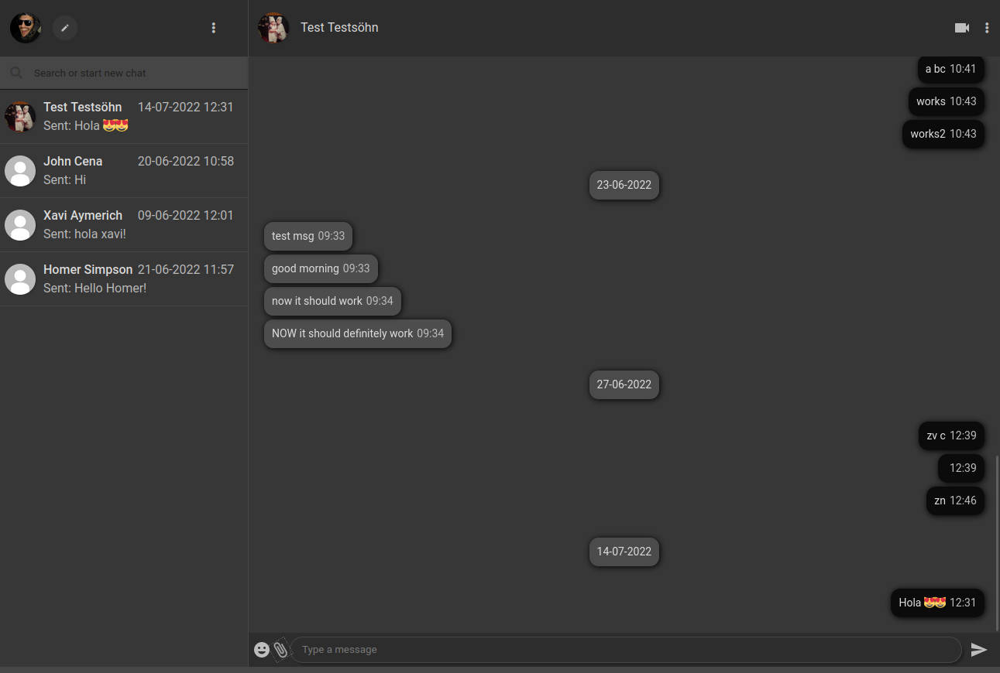

# WhatCet

An instant messaging web app inspired by WhatsApp.

(Still in development, in pause since july)

## How to use locally

Clone the repository on your local machine.

Open the index.php file directly on your browser or run the project using Live Server.

### Best option:

Run the project with xampp server

## Screenshot

## About the author

I'm [Dario Aladuz](https://github.com/darioaladuz), a Full Stack Web Developer. I've been programming for more than 3 years now and currently working on personal projects, and looking for a job position.

### License

MIT License